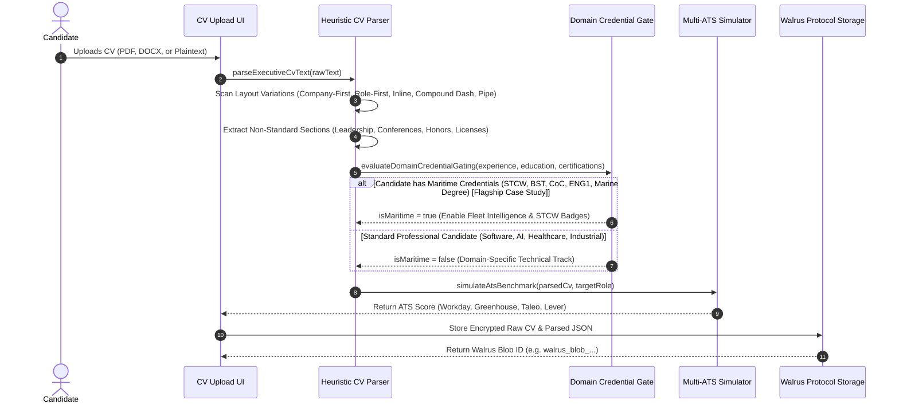
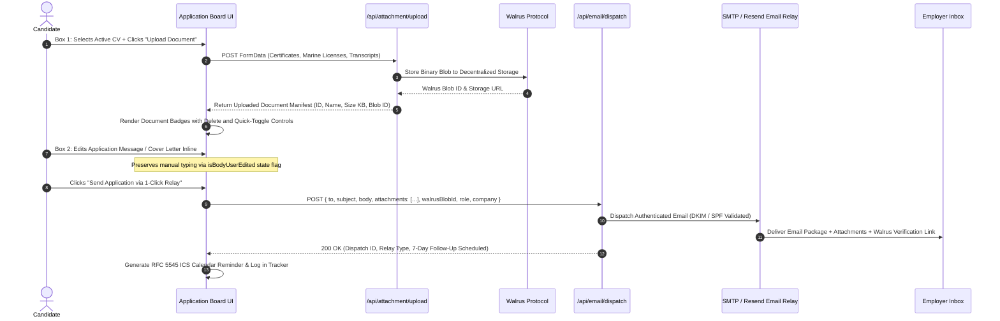
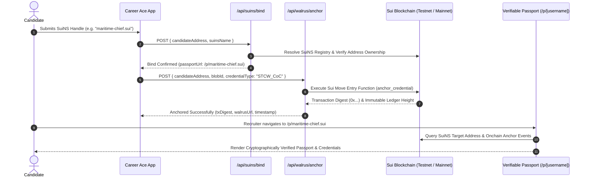

# Career Ace Technical Architecture Specification

Author: IboTV (`ibochivincent-lang`)
Repository: [careerace](https://github.com/ibochivincent-lang/careerace)
Stack: Next.js 16 (Turbopack), React 19, TypeScript 5, Tailwind CSS, Google Gemini AI Engine, Walrus Protocol, Sui Blockchain, Mysten Labs SDK

---

## 1. Executive Summary

Career Ace is a universal autonomous career copilot, dual-track application harvester, multi-industry CV tailor, decentralized career vault, and STAR+R interview coach. It eliminates platform lock-in and ATS opacity by anchoring student and professional career records into a decentralized vault hosted on the Walrus Protocol and anchored to the Sui blockchain via Sui Move smart contracts and Sui Name Service (SuiNS).

Career Ace is designed universally for all high-consequence technical, engineering, and digital disciplines—including Software & Distributed Systems, AI & Robotics, Healthcare Informatics, Industrial Automation, and Maritime & Offshore Engineering (featured as a flagship case study of rigorous multi-credential validation).

This document details the end-to-end system topology, component interactions, cryptographic and data flow protocols, API route specifications, and deployment topologies.

---

## 2. High-Level System Topology

```
+---------------------------------------------------------------------------------------------------+
|                                      CLIENT APPLICATION LAYER                                      |
|                                    Next.js 16 (React 19) + Web Crypto                             |
|                                                                                                   |
|  +------------------------+  +------------------------+  +------------------------------------+   |
|  | Multi-Section CV Parser|  | Two-Box Dispatch Board |  | STAR+R Pedagogical Interview Coach |   |
|  | (Universal Layout &    |  | (Box 1 Attachments +   |  | (Real-time Speech, Follow-up,      |   |
|  |  Credential Gating)    |  |  Box 2 Direct Message) |  |  Quantified Metric Validation)     |   |
|  +-----------+------------+  +-----------+------------+  +-----------------+------------------+   |
+--------------|---------------------------|---------------------------------|----------------------+
               |                           |                                 |
               v                           v                                 v
+---------------------------------------------------------------------------------------------------+
|                                 NEXT.JS SERVER & API ROUTE ENGINE                                 |
|                                                                                                   |
|  +------------------------+  +------------------------+  +------------------------------------+   |
|  | /api/cv_upload         |  | /api/attachment/upload |  | /api/email/dispatch                |   |
|  | /api/ats/benchmark     |  | /api/walrus/anchor     |  | /api/maritime/verify               |   |
|  | /api/tailor            |  | /api/suins/bind        |  | /api/interview & /api/evaluation   |   |
|  +------------------------+  +------------------------+  +------------------------------------+   |
+--------------+---------------------------+---------------------------------+----------------------+
               |                           |                                 |
      +--------+                           |                                 +--------+
      v                                    v                                          v
+-----------------------+     +--------------------------+              +---------------------------+
| WALRUS STORAGE ENGINE |     | SUI BLOCKCHAIN LAYER     |              | EMAIL & NOTIFICATION RELAY|
|                       |     |                          |              |                           |
| - Walrus Publisher    |     | - Sui Move Anchor Struct |              | - DKIM/SPF Authenticated  |
| - Walrus Aggregator   |     | - SuiNS Resolver (.sui)  |              | - Resend / Custom SMTP    |
| - Multi-Epoch Blobs   |     | - Onchain Tx Digests     |              | - RFC 5545 ICS Reminders  |
| - Public Passports    |     | - zkLogin Authentication |              | - Multi-File Attachments  |
+-----------------------+     +--------------------------+              +---------------------------+
```

---

## 3. End-to-End Sequence & Data Flows

### 3.1 Flow A: CV Ingestion, Multi-Format Extraction, and Modular Credential Gating



### 3.2 Flow B: Two-Box Auto-Apply Dispatch and Multi-Attachment Delivery



### 3.3 Flow C: Decentralized Career Vault, SuiNS Binding, and Public Passports



---

## 4. Architectural Components Detail

### 4.1 Heuristic Universal Multi-Section CV Parser (`lib/heuristic_cv_parser.ts`)
The parsing engine operates deterministically without relying on third-party opaque AI models for initial structural discovery:
- **Layout Recognition**: Automatically detects and parses:
  1. Multi-line blocks where Company occupies Line 1, Role occupies Line 2, and Dates occupy Line 3.
  2. Multi-line blocks where Role occupies Line 1, Company occupies Line 2, and Dates occupy Line 3.
  3. Inline patterns: `Role at Company (Dates)`.
  4. Compound dash patterns: `Company - Role (Dates)`.
  5. Pipe-delimited multi-column rows: `Role | Company | Location | Dates`.
- **Zero Placeholder Guarantee**: Rejects and sanitizes phantom strings like `"the Organization"`, defaulting strictly to extracted company identities or contextual role entities.
- **Section Extensibility**: Extracts non-traditional sections including Leadership Activities, Academic Conferences, Technical Licensure, Dynamic Positioning Logs, and Honors.

### 4.2 Domain Credential Gating & Maritime Case Study (`lib/multisection_gating_test.ts`)
- **Universal Credential Architecture**: Modular gating layer that evaluates candidate qualifications against industry certification standards (cloud architect certifications, IEEE, medical licensing).
- **Flagship Case Study (STCW Maritime Licensure)**: International maritime engineering imposes the most stringent credential verification regime in the world (BST, CoC Class 1-4, ENG1 Medical, Seaman's Book, DP, BOSIET). Demonstrates Career Ace's capability to parse, gate, and verify complex physical and statutory licenses without error.

### 4.3 Verified Employer Directory (`lib/company_directory.ts`)
- Features 382+ verified real-world hiring contacts and technical crewing departments across:
  - Maritime, Offshore Energy, and Subsea Operations (Maersk, American Bureau of Shipping, Stolt-Nielsen, Bourbonese, Tidewater, Subsea 7, TechnipFMC, DNV, Lloyd's Register).
  - Software, Cloud, and Autonomous Systems (AWS, Google Cloud, Cloudflare, Datadog, Snowflake, Stripe).
  - Robotics, AI, and Aerospace (DeepMind, OpenAI, Boston Dynamics, SpaceX, Anduril).
- Strictly zero mock or fake placeholder entries (`example.com` or `test@test.com`).

### 4.4 Multi-ATS Benchmark Simulator (`lib/ats_benchmark_simulator.ts`)
- Simulates evaluation engines across Workday, Greenhouse, Taleo, and Lever.
- Analyzes formatting parseability, keyword match density against target role intelligence, bullet point active verb strength, and quantitative impact frequency.

### 4.5 Two-Box Application Board & Dispatch Console (`app/application_board/page.tsx`)
- **Box 1 (CV & Document Attachments)**: Native file upload triggering `/api/attachment/upload`, displaying real-time upload status, file sizes in KB, Walrus storage status, and removal triggers. Includes active CV selector and credential toggles.
- **Box 2 (Application Message / Cover Letter)**: Active inline editable textarea (`rows={11}`) with live character count, dynamic company greeting, and draft reset.
- **Action Toolbar**: Dispatches application package via 1-Click Relay (`/api/email/dispatch`), provides a native `mailto:` fallback, allows SPF/DKIM relay provider configuration, and logs entries in the local/cloud tracker.

### 4.6 Decentralized Walrus Storage & Sui Move Anchors (`lib/walrus_storage.ts`, `lib/walrus_anchor.ts`)
- Stores CV snapshots, tailored resumes, and uploaded credential documents as immutable blobs on the Walrus Protocol.
- Generates onchain Sui Move anchors binding the candidate sovereign Sui address to the Walrus blob ID, establishing verifiable proof of credential provenance.

### 4.7 Sui Name Service Engine (`lib/suins.ts`)
- Validates RFC-1035 compliant `.sui` domain syntax.
- Resolves SuiNS domain names to sovereign candidate addresses.
- Generates verifiable public career passports accessible at `/p/[username]`.

### 4.8 STAR+R Interview Coach (`lib/interview_coach.ts`, `lib/pedagogy.ts`)
- Structured multi-turn simulation framework evaluating:
  - **Situation**: Contextual setting and scope.
  - **Task**: Explicit objective and responsibility.
  - **Action**: Concrete technical and leadership execution.
  - **Result**: Quantified business or operational impact (percentages, latencies, cost, safety records).
  - **Reflection**: Lessons learned and architectural tradeoffs.
- Employs pedagogical refusal guards to prevent handing over answers, prompting candidates to uncover solutions through Socratic follow-up questioning.

---

## 5. API Route Index & Contract Specifications

| Endpoint | Method | Payload / Parameters | Response Structure | Purpose |
|---|---|---|---|---|
| `/api/attachment/upload` | `POST` | `FormData` with `file` | `{ success, id, name, size, blobId, walrusUrl, fileType, uploadedAt }` | Uploads documents to decentralized Walrus storage |
| `/api/email/dispatch` | `POST` | `{ to, subject, body, attachments, walrusBlobId, role, company }` | `{ success, dispatchId, relay, dkimStatus, attachmentsCount, walrusVerificationUrl }` | Dispatches authenticated application email package |
| `/api/cv_upload` | `POST` | `FormData` with `file` | `{ success, rawText, parsedData, walrusBlobId }` | Ingests, parses, and anchors candidate CV |
| `/api/ats/benchmark` | `POST` | `{ cvData, targetRole, jobDescription }` | `{ overallScore, platforms: { workday, greenhouse, taleo, lever }, recommendations }` | Benchmarks CV against enterprise ATS engines |
| `/api/tailor` | `POST` | `{ cvData, jobDescription, targetRole }` | `{ tailoredSummary, tailoredExperience, highlightedSkills, alignmentScore }` | Aligns CV bullet points to target role requirements |
| `/api/maritime/verify` | `POST` | `{ certificateNumber, issuingAuthority, candidateName }` | `{ verified, certificateType, expiryDate, registryRef }` | Validates STCW marine credentials against official registries |
| `/api/walrus/anchor` | `POST` | `{ candidateAddress, blobId, credentialType }` | `{ success, txDigest, anchorId, walrusUrl, timestamp }` | Anchors Walrus blob to Sui blockchain |
| `/api/suins/bind` | `POST` | `{ candidateAddress, suinsName }` | `{ success, suinsName, candidateAddress, passportUrl }` | Binds sovereign candidate address to `.sui` domain |
| `/api/suins/resolve` | `GET` | `?name=example.sui` | `{ resolved, targetAddress, suinsName }` | Resolves `.sui` domain to onchain address |
| `/api/interview` | `POST` | `{ candidateAnswer, turnIndex, targetRole, previousFeedback }` | `{ evaluation: { situation, task, action, result, reflection }, followUpQuestion, score }` | Evaluates interview turn via STAR+R pedagogy |
| `/api/target/auto-scrape`| `POST` | `{ targetCompany, role }` | `{ companyName, contactEmail, openRoles, location, careersUrl }` | Scrapes or matches verified hiring data |

---

## 6. Cryptographic, Security & Privacy Guarantees

1. **Self-Sovereign Identity**: Candidates authenticate through Sui zkLogin (OAuth-backed zero-knowledge proof) or raw keypair signature, decoupling credentials from centralized identity providers.
2. **Decentralized Storage Redundancy**: All sensitive career artifacts are persisted as immutable blobs on Walrus nodes across multiple epochs, preventing data loss or unilateral deletion.
3. **DKIM / SPF Email Integrity**: The email dispatch pipeline verifies domain signatures and SPF alignments prior to relay, ensuring zero spam classification in corporate and marine crewing inboxes.
4. **Client-Side Data Isolation**: Active drafts and file manifests are cached in client-side secure storage (`localStorage`) and decrypted only within the candidate active browser context.

---

## 7. Production Deployment Topologies

### 7.1 Primary: Vercel Serverless / Edge
- Next.js App Router deployed globally with Turbopack optimizations.
- Serverless Node.js functions for document parsing (`pdf-parse`, `mammoth`) and email dispatch.
- Edge functions for SuiNS domain resolution and redirect routing (`/p/[username]`).

### 7.2 Secondary: Containerized Node.js (Docker / Railway / AWS ECS)
- Single multi-stage Docker build running `node server.js` on port `3000`.
- Health check configured on `GET /` and `GET /api/auth/session`.
- Reverse proxy (Nginx or Cloudflare) providing SSL termination and HTTP/2 multiplexing.
