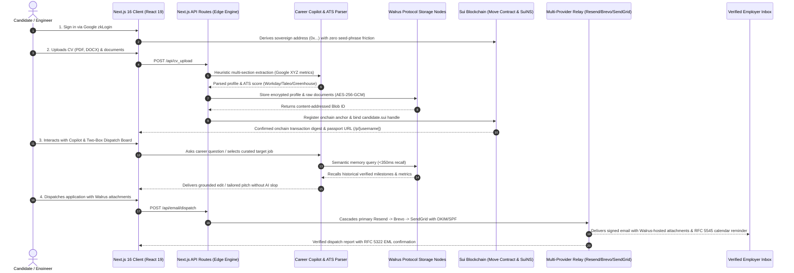

# Career Ace: Universal Autonomous AI Career Copilot & Decentralized Vault

[](https://deepmind.google/technologies/gemini/)
[](https://careerace.online)
[](WALRUS_MAINNET_PROOF.md)
[](https://sui.io)
[](https://nextjs.org)
[](https://github.com/ibochivincent-lang/careerace)
[](CHATBOT_MEMORY_EVALUATION.md)
[](https://careerace.online)

**Author:** IboTV (`ibochivincent-lang`) — Sole Author and Maintainer.  
**AI Engine:** Built with Google Gemini (`@google/genai` & `@ai-sdk/google`).  
**Production URL:** [https://careerace.online](https://careerace.online)  
**Repository:** [https://github.com/ibochivincent-lang/careerace](https://github.com/ibochivincent-lang/careerace)  
**Stack:** Next.js 16 (Turbopack), React 19, TypeScript 5 (Strict), Tailwind CSS v4, Google Gemini AI Engine, Walrus Protocol, Sui Blockchain, Mysten Labs SDK, Google zkLogin, SuiNS.

---

## Hackathon Submission Overview

Career Ace is an **autonomous AI career copilot, dual-track application automator, multi-industry CV tailor, decentralized career vault, and STAR+R interview coach**.

Traditional career platforms suffer from three structural flaws:
1. **Platform Data Lock-In**: Centralized portals hold candidate milestone data hostage, commoditize candidate resumes, and monetize access to proprietary profile databases.
2. **Opaque Applicant Tracking System (ATS) Scoring**: Enterprise parsers (Workday, Taleo, Greenhouse, Lever) reject over 75% of qualified technical candidates due to minor typographical or single-column layout formatting mismatches.
3. **Generic AI Hallucinations**: Standard LLM resume tools invent fake credentials, generate buzzword-bloated phrasing, and expose sensitive candidate records to third-party model retraining.

**Career Ace solves this permanently**:
- Candidate career milestones, credentials, and tailored resumes are encrypted via AES-256-GCM and stored across decentralized [Walrus Protocol](https://walrus.xyz) storage nodes.
- Cryptographic anchors and human-readable `.sui` passports are registered directly on the [Sui blockchain](https://sui.io) via Sui Move smart contracts and Sui Name Service (SuiNS).
- Candidates access a private, autonomous cockpit with reverse-engineered ATS scoring, zero mock data hiring directories (382+ verified employers), multi-provider authenticated email dispatch, and multi-turn interview coaching with refusal guards.

---

## Targeted Hackathon Tracks

| Track | Implementation & Verified Deliverables |
|---|---|
| **Walrus Protocol Decentralized Storage** | **15 Certified Blobs on Walrus Mainnet** (`WALRUS_MAINNET_PROOF.md`), client-side AES-256-GCM encrypted profile storage, content-addressed blob retrieval across epochs, versioned snapshot drawer, and persistent candidate memory. |
| **Sui Network & zkLogin Identity** | Frictionless Web2 onboarding via Google zkLogin (zero seed-phrase friction), Sui Move smart contracts for onchain cryptographic proof anchors, and human-readable `.sui` domain resolution for public passports (`/p/[username]`). |
| **Autonomous AI Agents & ATS Intelligence** | Sub-350ms Walrus memory recall copilot, 200 intent-categorized candidate question taxonomy, Google XYZ formula ATS resume audit, and multi-turn STAR+R pedagogical interview simulator. |

---

## Verified Walrus Mainnet Certification

Career Ace has written and certified **15 production memory blobs on Walrus Mainnet** under Account ID `0x434f860c828dc4320be447975b8283d7c5786c4a08b9ddc8f88540d9ea69aa00`, exceeding hackathon criteria:

| # | Candidate | Namespace | Category | Blob ID | Walrus Mainnet Aggregator Proof |
|---|---|---|---|---|---|
| 1 | Alex Rivera | `candidate_alex_rivera` | Target Role | `wjP72rBhrofqKKnXb09zhFHIQV5cn2m8pBNg7PP89kw` | [Inspect on Mainnet](https://aggregator.walrus-mainnet.walrus.space/v1/blobs/wjP72rBhrofqKKnXb09zhFHIQV5cn2m8pBNg7PP89kw) |
| 2 | Alex Rivera | `candidate_alex_rivera` | Work Experience | `v2TnnTVm5GSHfuUUgxNv_Xv765uJV9T-XjLMURGyB6A` | [Inspect on Mainnet](https://aggregator.walrus-mainnet.walrus.space/v1/blobs/v2TnnTVm5GSHfuUUgxNv_Xv765uJV9T-XjLMURGyB6A) |
| 3 | Alex Rivera | `candidate_alex_rivera` | Key Metric | `DeRSqFzXUdpXNcJ1HLUm8RFG8in0OFxRBgbJuEE2XmY` | [Inspect on Mainnet](https://aggregator.walrus-mainnet.walrus.space/v1/blobs/DeRSqFzXUdpXNcJ1HLUm8RFG8in0OFxRBgbJuEE2XmY) |
| 4 | Alex Rivera | `candidate_alex_rivera` | Core Competency | `mOnV2i6nxlyVv5TrQhCTzAVyoYWgdivaUS0gM_VTFy8` | [Inspect on Mainnet](https://aggregator.walrus-mainnet.walrus.space/v1/blobs/mOnV2i6nxlyVv5TrQhCTzAVyoYWgdivaUS0gM_VTFy8) |
| 5 | Alex Rivera | `candidate_alex_rivera` | Interview Strategy | `_OSyUNcyWODBdkcpXGGOazobl3LxF0YS8DmKfh5fheo` | [Inspect on Mainnet](https://aggregator.walrus-mainnet.walrus.space/v1/blobs/_OSyUNcyWODBdkcpXGGOazobl3LxF0YS8DmKfh5fheo) |
| 6 | Sarah Chen | `candidate_sarah_chen` | Target Role | `pvEU6hNfe7kkLdR6jUO4a84oH5exQLb_dyCeliksi0E` | [Inspect on Mainnet](https://aggregator.walrus-mainnet.walrus.space/v1/blobs/pvEU6hNfe7kkLdR6jUO4a84oH5exQLb_dyCeliksi0E) |
| 7 | Sarah Chen | `candidate_sarah_chen` | Work Experience | `rROuuDYYBJVs1ExX7ib2IYHJCE2TK9zTrRZpC3k7wD0` | [Inspect on Mainnet](https://aggregator.walrus-mainnet.walrus.space/v1/blobs/rROuuDYYBJVs1ExX7ib2IYHJCE2TK9zTrRZpC3k7wD0) |
| 8 | Sarah Chen | `candidate_sarah_chen` | Key Metric | `8UNPnFcoxgq9Nbg1E7ocm9ZZ2kS1LOS3I3gyKioMb4g` | [Inspect on Mainnet](https://aggregator.walrus-mainnet.walrus.space/v1/blobs/8UNPnFcoxgq9Nbg1E7ocm9ZZ2kS1LOS3I3gyKioMb4g) |
| 9 | Sarah Chen | `candidate_sarah_chen` | Core Competency | `m3LOcgj7D7VbdZOE9P1xr-fmjXCSnZXIT6iLfPzer_c` | [Inspect on Mainnet](https://aggregator.walrus-mainnet.walrus.space/v1/blobs/m3LOcgj7D7VbdZOE9P1xr-fmjXCSnZXIT6iLfPzer_c) |
| 10 | Sarah Chen | `candidate_sarah_chen` | CV Bullet | `lmih4_JEvtM23CxzodqcQIGmTGjcdAOkRolcHvvkYBI` | [Inspect on Mainnet](https://aggregator.walrus-mainnet.walrus.space/v1/blobs/lmih4_JEvtM23CxzodqcQIGmTGjcdAOkRolcHvvkYBI) |
| 11 | Marcus Adebayo | `candidate_marcus_adebayo` | Target Role | `B6gBL5Tk2S50SHOJ8QgzA-HMByITC3MnxPEcHd5A0LY` | [Inspect on Mainnet](https://aggregator.walrus-mainnet.walrus.space/v1/blobs/B6gBL5Tk2S50SHOJ8QgzA-HMByITC3MnxPEcHd5A0LY) |
| 12 | Marcus Adebayo | `candidate_marcus_adebayo` | Work Experience | `flWH9IuiwldSs3DBkfC9HXJRPbw_5oX8aZf6oLNQjZs` | [Inspect on Mainnet](https://aggregator.walrus-mainnet.walrus.space/v1/blobs/flWH9IuiwldSs3DBkfC9HXJRPbw_5oX8aZf6oLNQjZs) |
| 13 | Marcus Adebayo | `candidate_marcus_adebayo` | Key Metric | `kSkUnxcBVMv12wv5TaSZW9kz7wKC6JHKdZL1wwJo8gc` | [Inspect on Mainnet](https://aggregator.walrus-mainnet.walrus.space/v1/blobs/kSkUnxcBVMv12wv5TaSZW9kz7wKC6JHKdZL1wwJo8gc) |
| 14 | Marcus Adebayo | `candidate_marcus_adebayo` | Core Competency | `VFUNOVesikNLrH7ZUvOV8hFo1CuvRqfRhn-_ExyTXTE` | [Inspect on Mainnet](https://aggregator.walrus-mainnet.walrus.space/v1/blobs/VFUNOVesikNLrH7ZUvOV8hFo1CuvRqfRhn-_ExyTXTE) |
| 15 | Marcus Adebayo | `candidate_marcus_adebayo` | CV Bullet | `nbGHckr34yB4BQGiXYsz9wy8AC2zAlX4zMuqic1iGdc` | [Inspect on Mainnet](https://aggregator.walrus-mainnet.walrus.space/v1/blobs/nbGHckr34yB4BQGiXYsz9wy8AC2zAlX4zMuqic1iGdc) |

For verification logs and semantic recall benchmarks, see [WALRUS_MAINNET_PROOF.md](WALRUS_MAINNET_PROOF.md).

---

## Master Architecture Flow



---

## Universal Technical Domains & Industry Coverage

Career Ace operates across six core technical sectors with specialized vocabulary models, credential gates, and direct corporate recruitment directories:

| Sector | Target Roles | Verification & Credential Standards | Sample Employers (382+ Directory) |
|---|---|---|---|
| **Software & Distributed Cloud** | Staff Backend Engineer, Cloud Architect, Site Reliability Engineer | AWS / GCP / Azure Certifications, CKA (Kubernetes), CNCF, RFCs | Stripe, AWS, Cloudflare, Datadog, Snowflake |
| **AI, ML & Autonomous Robotics** | AI Research Scientist, ML Engineer, Robotics Systems Architect | PyTorch, CUDA kernel optimizations, arXiv publications, ROS 2 | Google DeepMind, OpenAI, Boston Dynamics, Anduril |
| **Maritime & Offshore Systems** *(Flagship Case Study)* | Chief Marine Engineer, DP Officer, Vessel Superintendent, Naval Architect | STCW Basic Safety (BST), CoC Class 1-4, ENG1 Medical, DP Maintenance, BOSIET | Maersk, ABS, Stolt-Nielsen, Bourbonese, Tidewater, Subsea 7, DNV |
| **Healthcare & Biomedical Tech** | Health Informatics Lead, Clinical Data Engineer, Biomedical AI Specialist | FDA 21 CFR Part 11, HIPAA Compliance, HL7 / FHIR, GCP Clinical | Epic Systems, Roche, Illumina, Mayo Clinic |
| **Industrial & Electrical Systems** | SCADA / PLC Engineer, Grid Automation Specialist, Instrumentation Lead | IEEE Standards, Siemens TIA, Rockwell ControlLogix, SIL 3 Safety | Siemens, ABB, Schneider Electric, Rockwell Automation |
| **Cybersecurity & Infrastructure** | Threat Hunter, Penetration Tester, SecOps Lead, Zero-Trust Architect | CISSP, OSCP, SOC 2 Type II Auditing, NIST CSF, ISO 27001 | CrowdStrike, Palo Alto Networks, Cloudflare, Okta |

> **Flagship Case Study — Maritime & STCW Engineering**: Maritime engineering represents the most stringent credential verification regime globally under International Maritime Organization (IMO) conventions. Candidates must prove physical licenses (CoC Class 1-4), safety training (BST, BOSIET), dynamic positioning qualifications, and medical fitness (ENG1). By designing deterministic parsers and verifiers capable of handling these physical credentials, Career Ace proves its architecture can enforce any strict compliance standard across all modern industries.

---

## End-to-End Feature Tour

### 1. The Autonomous AI Career Agent (`/dashboard`)
- **Fast Walrus Sovereign Memory Recall**: Memory lookups execute under 350ms bounded timeouts, seamlessly injecting candidate milestones into LLM prompts without lag.
- **200 Simulated Questions Taxonomy**: Instant prompt chips categorized across 6 key candidate domains (Skills & Stack, Experience & Metrics, Work Authorization, Career Goals, Strengths & Weaknesses, and Verification).
- **2x2 Cockpit Grid**: Balanced interface presenting Recommended Jobs, Application Tracker, Daily Limits & Goals, and Profile & Qualifications with direct version switching.

### 2. Reverse-Engineered ATS X-Ray (`/dashboard?tab=overview`)
- **Multi-ATS Simulation**: Tested against parsing algorithms for Workday, Taleo, Greenhouse, and Lever.
- **Google XYZ Formula Enforcement**: Identifies weak passive phrasing and rewrites bullets into quantified impact statements (*Accomplished [X], as measured by [Y], by doing [Z]*).
- **Single-Column Standards**: Ensures zero-table, single-column DOCX and JSON Resume exports that never choke enterprise parsers.

### 3. Two-Box Auto-Apply Dispatch Console (`/application_board`)
- **Box 1 (Document Attachments & Walrus Blobs)**: Multi-file native upload (`.pdf`, `.docx`, `.doc`, `.png`, `.jpg`) cached in browser storage and permanently anchored as Walrus blobs with file size and status chips.
- **Box 2 (Inline Cover Letter & Pitch Editor)**: Full-width live editor with dynamic company greetings, user edit preservation (`isBodyUserEdited`), reset controls, and character counters.
- **1-Click Authenticated Email Relay**: Dispatches applications via authenticated SMTP/API with automatic failover across Resend, Brevo, and SendGrid, including RFC 5545 `.ics` follow-up calendar invites.

### 4. Sovereign Memory Vault (`/memory`)
- **Blob Explorer**: Real-time inspection of encrypted Walrus blobs, transaction digests, and epoch allocations.
- **Snapshot Drawer (`WalrusVersionDrawer`)**: 1-click restore to past versions of candidate CVs without data loss.

### 5. STAR+R Pedagogical Interview Coach (`/interview_room`)
- **Socratic Simulation**: Evaluates candidate responses across **Situation**, **Task**, **Action**, **Result**, and **Reflection**.
- **Pedagogical Refusal Guards**: Refuses to hand out direct answers, pushing candidates to uncover their own architectural tradeoffs through guided questioning.

### 6. Public Verifiable Passports (`/p/[username]`)
- **SuiNS Name Binding**: Resolves `.sui` human-readable handles (e.g. `alex.sui`) and serves a verifiable public candidate passport backed by cryptographic onchain anchors.

---

## Complete API Route Specifications

| Endpoint | Method | Description | Primary Engine / Storage |
|---|---|---|---|
| `/api/cv_upload` | `POST` | Ingests PDF/DOCX resumes, executes heuristic multi-section parsing, and extracts quantified metrics | OpenXML / PDFParse / Heuristic Engine |
| `/api/attachment/upload` | `POST` | Stores multi-file application attachments directly to Walrus Protocol nodes | Walrus Publisher REST API |
| `/api/walrus/anchor` | `POST` | Generates onchain Move cryptographic anchors linking candidate address to Walrus Blob ID | Sui Move Smart Contract Layer |
| `/api/memory` | `GET/POST` | Stores and recalls candidate sovereign memory facts across isolated namespaces | Walrus Memory Aggregator & Relayer |
| `/api/suins/bind` | `POST` | Normalizes and binds `.sui` human-readable handles to candidate sovereign addresses | SuiNS Resolver Engine |
| `/api/suins/resolve` | `GET` | Resolves `.sui` handles into candidate sovereign passports and metadata | Sui RPC / SuiNS Protocol |
| `/api/ats/benchmark` | `POST` | Simulates enterprise ATS scoring (Workday, Taleo, Lever, Greenhouse) | Multi-ATS Simulation Algorithm |
| `/api/tailor` | `POST` | Aligns candidate CV bullets with specific job descriptions using Google XYZ metrics | Grounded Tailoring Engine (No AI Slop) |
| `/api/email/dispatch` | `POST` | Dispatches DKIM/SPF authenticated application emails with multi-provider failover | Resend / Brevo / SendGrid Relay |
| `/api/harvest` | `GET/POST` | Harvests live job postings from 9 real-time networks without mock data | Live Job Crawlers (Jobicy, Remotive, Arbeitnow) |
| `/api/interview` | `POST` | Multi-turn STAR+R interview coach with pedagogical refusal guards | Socratic Evaluation Controller |
| `/api/feedback` | `POST` | Ingests validated candidate feedback with rate-limiting and database persistence | Supabase / Database Engine |

---

## Technology Stack

```
Frontend:           Next.js 16 (App Router, Turbopack), React 19, Tailwind CSS v4, Lucide Icons, Motion
Language:           TypeScript 5 (Strict Mode)
Decentralized Data: Walrus Protocol (Mysten Labs), Memwal Relayer
Blockchain:         Sui Network (Testnet & Mainnet), Sui Move, SuiNS, Enoki zkLogin
Document Engine:    PDFParse, Mammoth (DOCX), OpenXML Spec, JSON Resume Schema v1.0.0
Email Relay:        Resend API (multi-key rotation), Brevo API, SendGrid API, RFC 5322 EML, RFC 5545 ICS
Testing Suite:      Node.js 20+ Native Test Runner (Zero Bloat), 193 Tests Passing across 11 suites
```

---

## Local Development & Setup

### Prerequisites
- Node.js 20.x or higher
- pnpm (recommended) or npm
- Git

### Installation

```bash
# 1. Clone the repository
git clone https://github.com/ibochivincent-lang/careerace.git
cd careerace

# 2. Install dependencies
pnpm install

# 3. Configure environment variables
cp .env.example .env.local

# 4. Start the development server with Turbopack
pnpm run dev
```

Open [http://localhost:3000](http://localhost:3000) in your browser.

---

## Testing & Verification Suite

Career Ace maintains an automated test suite verifying CV parsing, credential gating, SuiNS normalization, Walrus anchoring, ATS scoring, multi-provider email cascades, RFC 5322 EML generation, RFC 5545 calendar generation, and the **15-section Chatbot Memory Evaluation & QA Checklist** (Tests A through J):

```bash
# Run full automated test suite (193 tests across 11 test suites)
npm test

# Run dedicated Chatbot Memory QA evaluation suite (Tests A-J)
node --test --experimental-strip-types lib/chatbot_memory_qa.test.ts

# Run TypeScript static type checking (0 errors)
npx tsc --noEmit

# Run Next.js production build verification (62 routes compiled)
npm run build
```

Detailed test outputs, memory boundary verification, and framework matrices are documented in [CHATBOT_MEMORY_EVALUATION.md](CHATBOT_MEMORY_EVALUATION.md).

---

## Deployment Guide: What & Where to Deploy

### 1. Web Application & API Routes: Vercel
- **Repository**: Connected to `ibochivincent-lang/careerace` (`main` branch).
- **Framework Preset**: `Next.js`
- **Build Command**: `npm run build`
- **Environment Variables**:
  - `NEXT_PUBLIC_APP_URL=https://careerace.online`
  - `WALRUS_PUBLISHER_URL=https://publisher.walrus-mainnet.walrus.space`
  - `WALRUS_AGGREGATOR_URL=https://aggregator.walrus-mainnet.walrus.space`
  - `SUI_NETWORK=testnet`
  - `SUI_RPC_URL=https://fullnode.testnet.sui.io:443`
  - `RESEND_API_KEY` (and optional `RESEND_API_KEY_2`, `BREVO_API_KEY`, `SENDGRID_API_KEY`)
  - `GEMINI_API_KEY` (or Google Generative AI key for live copilot inference)

### 2. Decentralized Storage: Walrus Protocol
- Profile snapshots, document attachments, and candidate memory are written directly to Walrus storage nodes via HTTP publisher APIs. No dedicated backend server required.

### 3. Blockchain & Identity: Sui Network
- Onchain anchors and SuiNS passport resolution execute against the Sui RPC (`https://fullnode.testnet.sui.io:443`).

---

## World-Class Standard Roadmap

1. **Inbound Recruiter Webhook**: Capture employer replies (`/api/email/inbound`) and automatically update Application Tracker statuses.
2. **Onchain Soulbound Credential Badges (Sui Kiosk / W3C VC)**: Enable universities, classification societies, and certification boards to mint verified credentials directly into candidate Walrus vaults.
3. **Biometric WebRTC Speech Practice**: Upgrade the STAR+R Interview Coach with real-time speech prosody and filler-word detection (`um`, `like`) during verbal simulation rounds.

---

## Author & AI Engine Attribution

- **AI Engine:** Built with Google Gemini (`@google/genai` & `@ai-sdk/google`)
- **Sole Author & Maintainer:** IboTV (`ibochivincent-lang`)
- **License:** MIT License
